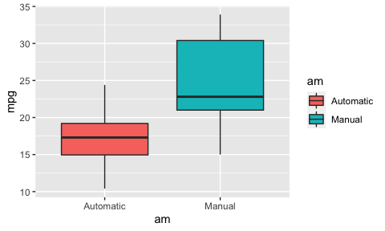
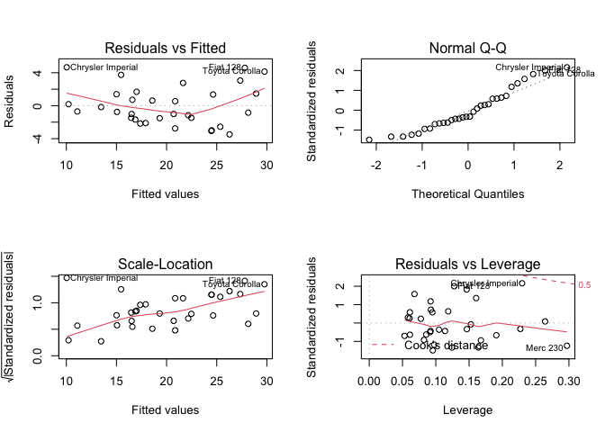

# Executive summary

The aim of the following study is to evaluate the relationship among the outcome mpg (Miles/(US) gallon) and the other variables of the 'mtcars' data set. The main questions: is an automatic or manual transmission better for mtcars? It is also asked to quantify the mtcars difference between automatic and manual transmissions.

# Data loading and manipulation


```r
library('ggplot2', 'datasets'); data('mtcars')
mtcars$am <- as.factor(mtcars$am); levels(mtcars$am) <- c('Automatic', 'Manual')
```

# Exploratory data analysis

For details on the data set see Appendix A. For graphs on interesting variables see Appendix B.  

The data set has 32 observations and 11 variables. The relevant variables are mpg (outcome) and am (asked regressor). The plot in Appendix B shows that there is a possible relationship between the two variables: the manual transmission has a higher mpg compared to the automatic one.  

A t-test could be performed to evaluate the difference of the mean value of the two groups. The formula option in the r function "t-test" will divide the data set into the two groups.


```r
tTest1 <- t.test(formula = mpg ~ am, data = mtcars); tTest1$p.value
```

```
## [1] 0.001373638
```

The null hypothesis is that the two groups are similar. Since the p-value is less than 0.05, it is unlikely that the two groups differ just by chance. Hence the null hypothesis is rejected and the alternative hypothesis is accepted (transmission influences mpg).

# Model selection

## Linear model based on transmission

The t-test proved that there is a relationship between mpg and am. The first attempt will be modeling mpg only with am.


```r
lm1 <- lm(mpg ~ am, data = mtcars)
```
The p-value for this linear model is low, hence the coefficient is significant (significantly different from 0) (see reference in Appendix C). However the adjusted R-squared is low. This means that the variation explained by the model is poor. For this reason, other models should be evaluated.

## Linear model based on all the variables


```r
lmAll <- lm(mpg ~ ., data = mtcars)
require('car'); vif(lmAll) # Variance inflation factors
```

```
##       cyl      disp        hp      drat        wt      qsec        vs        am 
## 15.373833 21.620241  9.832037  3.374620 15.164887  7.527958  4.965873  4.648487 
##      gear      carb 
##  5.357452  7.908747
```

The p-values for this model are not significant. Furthermore, the variation inflation factors, which indicate the proportional increase in the variance for the i-th coefficient respect to the case in which the i-th variable is completely independent from the others, are high for many variables. The higher the VIF, the higher the collinearity with the other variables.

## Accepted linear model


```r
lm3 <- lm(mpg ~ am + wt + qsec, data = mtcars)
```

The linear model based on transmission, weight and 1/4 mile time has p-values under 0.05 and adjusted R-squaded around 0.83. The usage of other regressors do not increase R-squared significantly but gets worse p-values.  

The coefficient for transmission claims that manual transmission delivers around 2.94 more mpg than the automatic one.

## Diagnostics

Diagnostics plots are shown in Appendix D. Some aspects:

- Residual VS fitted values plot shows there is not any particular pattern, so the dependency among mpg and the other values seems to be only linear.  

- The normal Q-Q plot shows that the points almost follow the line, hence the standardized residuals are normally distributed.  

- The Residual VS Leverage plot shows there are no relevant leverage points.  

## Conclusion

The answers to the initial questions are:
- manual transmission is better for mtcars
- manual transmission delivers around 2.94 more mpg than the automatic transmission. The model which provides this result has p-values under 0.05 and adjusted R-squared equal to 0.83.


\newpage
## Appendix A - mtcars data set


```r
knitr::kable(head(mtcars))
```


|                  |  mpg| cyl| disp|  hp| drat|    wt|  qsec| vs|am        | gear| carb|
|:-----------------|----:|---:|----:|---:|----:|-----:|-----:|--:|:---------|----:|----:|
|Mazda RX4         | 21.0|   6|  160| 110| 3.90| 2.620| 16.46|  0|Manual    |    4|    4|
|Mazda RX4 Wag     | 21.0|   6|  160| 110| 3.90| 2.875| 17.02|  0|Manual    |    4|    4|
|Datsun 710        | 22.8|   4|  108|  93| 3.85| 2.320| 18.61|  1|Manual    |    4|    1|
|Hornet 4 Drive    | 21.4|   6|  258| 110| 3.08| 3.215| 19.44|  1|Automatic |    3|    1|
|Hornet Sportabout | 18.7|   8|  360| 175| 3.15| 3.440| 17.02|  0|Automatic |    3|    2|
|Valiant           | 18.1|   6|  225| 105| 2.76| 3.460| 20.22|  1|Automatic |    3|    1|

```r
str(mtcars)
```

```
## 'data.frame':	32 obs. of  11 variables:
##  $ mpg : num  21 21 22.8 21.4 18.7 18.1 14.3 24.4 22.8 19.2 ...
##  $ cyl : num  6 6 4 6 8 6 8 4 4 6 ...
##  $ disp: num  160 160 108 258 360 ...
##  $ hp  : num  110 110 93 110 175 105 245 62 95 123 ...
##  $ drat: num  3.9 3.9 3.85 3.08 3.15 2.76 3.21 3.69 3.92 3.92 ...
##  $ wt  : num  2.62 2.88 2.32 3.21 3.44 ...
##  $ qsec: num  16.5 17 18.6 19.4 17 ...
##  $ vs  : num  0 0 1 1 0 1 0 1 1 1 ...
##  $ am  : Factor w/ 2 levels "Automatic","Manual": 2 2 2 1 1 1 1 1 1 1 ...
##  $ gear: num  4 4 4 3 3 3 3 4 4 4 ...
##  $ carb: num  4 4 1 1 2 1 4 2 2 4 ...
```

## Appendix B - Exploratory data analysis


```r
qplot(am, mpg, data=mtcars, geom='boxplot', fill=am)
```



# Appendix C - Summaries for different models

## Linear model based on transmission


```r
summary(lm1)
```

```
## 
## Call:
## lm(formula = mpg ~ am, data = mtcars)
## 
## Residuals:
##     Min      1Q  Median      3Q     Max 
## -9.3923 -3.0923 -0.2974  3.2439  9.5077 
## 
## Coefficients:
##             Estimate Std. Error t value Pr(>|t|)    
## (Intercept)   17.147      1.125  15.247 1.13e-15 ***
## amManual       7.245      1.764   4.106 0.000285 ***
## ---
## Signif. codes:  0 '***' 0.001 '**' 0.01 '*' 0.05 '.' 0.1 ' ' 1
## 
## Residual standard error: 4.902 on 30 degrees of freedom
## Multiple R-squared:  0.3598,	Adjusted R-squared:  0.3385 
## F-statistic: 16.86 on 1 and 30 DF,  p-value: 0.000285
```

## Linear model based all the other variables


```r
summary(lmAll)
```

```
## 
## Call:
## lm(formula = mpg ~ ., data = mtcars)
## 
## Residuals:
##     Min      1Q  Median      3Q     Max 
## -3.4506 -1.6044 -0.1196  1.2193  4.6271 
## 
## Coefficients:
##             Estimate Std. Error t value Pr(>|t|)  
## (Intercept) 12.30337   18.71788   0.657   0.5181  
## cyl         -0.11144    1.04502  -0.107   0.9161  
## disp         0.01334    0.01786   0.747   0.4635  
## hp          -0.02148    0.02177  -0.987   0.3350  
## drat         0.78711    1.63537   0.481   0.6353  
## wt          -3.71530    1.89441  -1.961   0.0633 .
## qsec         0.82104    0.73084   1.123   0.2739  
## vs           0.31776    2.10451   0.151   0.8814  
## amManual     2.52023    2.05665   1.225   0.2340  
## gear         0.65541    1.49326   0.439   0.6652  
## carb        -0.19942    0.82875  -0.241   0.8122  
## ---
## Signif. codes:  0 '***' 0.001 '**' 0.01 '*' 0.05 '.' 0.1 ' ' 1
## 
## Residual standard error: 2.65 on 21 degrees of freedom
## Multiple R-squared:  0.869,	Adjusted R-squared:  0.8066 
## F-statistic: 13.93 on 10 and 21 DF,  p-value: 3.793e-07
```

## Linear model based on transmission, weight and 1/4 mile time


```r
summary(lm3)
```

```
## 
## Call:
## lm(formula = mpg ~ am + wt + qsec, data = mtcars)
## 
## Residuals:
##     Min      1Q  Median      3Q     Max 
## -3.4811 -1.5555 -0.7257  1.4110  4.6610 
## 
## Coefficients:
##             Estimate Std. Error t value Pr(>|t|)    
## (Intercept)   9.6178     6.9596   1.382 0.177915    
## amManual      2.9358     1.4109   2.081 0.046716 *  
## wt           -3.9165     0.7112  -5.507 6.95e-06 ***
## qsec          1.2259     0.2887   4.247 0.000216 ***
## ---
## Signif. codes:  0 '***' 0.001 '**' 0.01 '*' 0.05 '.' 0.1 ' ' 1
## 
## Residual standard error: 2.459 on 28 degrees of freedom
## Multiple R-squared:  0.8497,	Adjusted R-squared:  0.8336 
## F-statistic: 52.75 on 3 and 28 DF,  p-value: 1.21e-11
```

# Appendix D - Diagnostics plots


```r
par(mfrow=c(2,2)); plot(lm3)
```

<!-- -->
